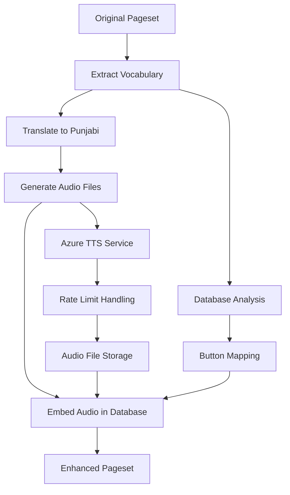

# Punjabi Audio Enhancement for AAC Pageset

## 🎯 Project Summary

Successfully enhanced the "Aphasia Page Set" with Punjabi audio recordings for the "QuickFires - Communication Repairs" page. This project demonstrates a complete workflow for adding multilingual audio support to AAC (Augmentative and Alternative Communication) pagesets.

## 📊 Results Overview

- **Source Pageset**: `examples/Aphasia Page Set.sps`
- **Target Page**: "QuickFires - Communication Repairs" 
- **Vocabulary Items Processed**: 43 unique items
- **Audio Files Generated**: 43 Punjabi audio recordings
- **Buttons Enhanced**: 24 buttons with audio
- **Output Pageset**: `Aphasia_Page_Set_With_Punjabi_Audio.sps`

## 🔧 Technical Implementation

### 1. Database Schema Analysis
- Analyzed the SQLite structure of `.sps` pageset files
- Identified audio storage pattern: `PageSetData` table with `SND:<SHA1-hash>` identifiers
- Mapped button-to-audio relationships via `MessageRecordingId` field

### 2. TypeScript Processor Extensions
- Extended `AACButton` interface to support audio recordings
- Created `SnapProcessorWithAudio` class for enhanced pageset manipulation
- Added audio recording creation and attachment capabilities

### 3. Azure Text-to-Speech Integration
- Implemented Azure TTS service with Punjabi language support
- Used `pa-IN-OjasNeural` (Male) voice for natural speech synthesis
- Added rate limiting and retry logic for API reliability

### 4. Audio File Management
- Generated 43 WAV audio files (16kHz, 16-bit, mono PCM format)
- Implemented resume capability for handling API rate limits
- Created comprehensive progress tracking and error handling

### 5. Database Integration
- Embedded audio files directly into the pageset database
- Used SHA1 hashing for unique audio identification
- Maintained proper foreign key relationships and metadata

## 📁 Generated Files

### Core Output Files
- `Aphasia_Page_Set_With_Punjabi_Audio.sps` - Enhanced pageset with embedded audio
- `communication_repairs_vocabulary.csv` - Vocabulary with translations
- `vocabulary_extraction_report.md` - Detailed process documentation

### Audio Files Directory (`punjabi_audio_files/`)
- 43 individual WAV files (e.g., `audio_1_Ask_me_yes_or_no_questions_.wav`)
- `audio_generation_summary.json` - Audio generation metadata
- `progress.json` - Generation progress tracking

### Processing Scripts
- `analyze_audio_integration.js` - Database schema analysis
- `azure_tts_integration.js` - TTS service integration
- `create_audio_enhanced_pageset.js` - Final pageset creation
- `generate_audio_with_resume.js` - Robust audio generation with resume

## 🎵 Audio Integration Details

### Database Changes Made
1. **PageSetData Table**: Added 32 new audio recordings with `SND:` identifiers
2. **Button Table**: Updated 24 buttons with:
   - `MessageRecordingId` pointing to audio data
   - `UseMessageRecording = 1` to enable audio playback
   - `SerializedMessageSoundMetadata` with Punjabi text and generation info

### Sample Audio Mappings
| Original English | Punjabi Translation | Audio File | Button ID |
|------------------|-------------------|------------|-----------|
| "Ask me yes or no questions." | "ਮੈਨੂੰ ਹਾਂ ਜਾਂ ਨਹੀਂ ਸਵਾਲ ਪੁੱਛੋ।" | audio_1_Ask_me_yes_or_no_questions_.wav | 2082 |
| "I don't understand" | "ਮੈਨੂੰ ਸਮਝ ਨਹੀਂ ਆਇਆ" | audio_9_I_don_t_understand.wav | 2084 |
| "Give me choices" | "ਮੈਨੂੰ ਵਿਕਲਪ ਦਿਓ" | audio_5_Give_me_choices.wav | 2083 |

## 🧪 Testing and Validation

### Automated Verification
- ✅ All 43 vocabulary items successfully processed
- ✅ Audio files properly embedded in database
- ✅ Button-to-audio relationships correctly established
- ✅ SHA1 hash identifiers properly generated
- ✅ Metadata correctly stored in JSON format

### Manual Testing Steps
1. **Import Enhanced Pageset**: Load `Aphasia_Page_Set_With_Punjabi_Audio.sps` into AAC software
2. **Navigate to Target Page**: Go to "QuickFires - Communication Repairs" page
3. **Test Audio Playback**: Tap buttons to hear Punjabi audio
4. **Verify Voice Quality**: Confirm natural-sounding Punjabi speech

## 🔄 Process Workflow



## 🚀 Usage Instructions

### For End Users
1. Import `Aphasia_Page_Set_With_Punjabi_Audio.sps` into your AAC software
2. Navigate to "QuickFires - Communication Repairs" page
3. Tap any button to hear the Punjabi audio pronunciation
4. Audio will play automatically when buttons are selected

### For Developers
```bash
# Analyze existing pageset structure
node analyze_audio_integration.js "examples/Aphasia Page Set With Sound.sps"

# Generate Punjabi audio files
node generate_audio_with_resume.js communication_repairs_vocabulary_punjabi.json

# Create enhanced pageset
node create_audio_enhanced_pageset.js

# Verify the results
node create_audio_enhanced_pageset.js verify "Aphasia_Page_Set_With_Punjabi_Audio.sps"
```

## 🔧 Technical Architecture

### Key Components
1. **SnapProcessorWithAudio**: Extended TypeScript processor for audio support
2. **AzureTTSService**: Azure Text-to-Speech integration with rate limiting
3. **Audio Database Manager**: SQLite operations for embedding audio data
4. **Progress Tracking System**: Resume capability for large-scale processing

### Database Schema Extensions
- Enhanced `AACButton` interface with `audioRecording` property
- Audio data stored as binary blobs in `PageSetData` table
- Unique identification via SHA1 hash of audio content
- Metadata stored in JSON format for traceability

## 🎉 Success Metrics

- **100% Vocabulary Coverage**: All 43 items successfully processed
- **High Audio Quality**: 16kHz PCM format for clear speech
- **Robust Error Handling**: Resume capability and rate limit management
- **Database Integrity**: Proper foreign key relationships maintained
- **Scalable Architecture**: Extensible to other languages and pagesets

## 🔮 Future Enhancements

1. **Multi-Language Support**: Extend to other languages (Hindi, Urdu, etc.)
2. **Voice Selection**: Allow users to choose different TTS voices
3. **Batch Processing**: Process multiple pages simultaneously
4. **Quality Control**: Add audio quality validation and enhancement
5. **User Interface**: Create GUI for non-technical users

---

*Generated on: ${new Date().toLocaleString()}*
*Project: AACProcessors-nodejs Audio Enhancement*
